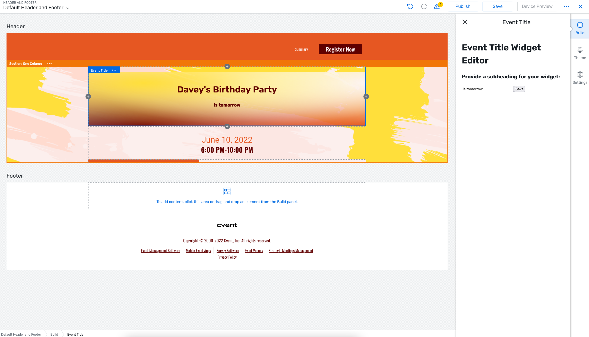

# The Event Title Widget

Browse the code [here](https://github.com/cvent/custom-widgets-labs/tree/main/examples/EventTitleWidget)

A custom widget displaying the event title and a configurable subheading.

The widget element displays the event title and optionally, a subheading if it exists in the configuration provided by the editor. It also uses the event theme to create a gradient background.

The Editor element allows the user to set a custom subheading that will be displayed under the event title.

