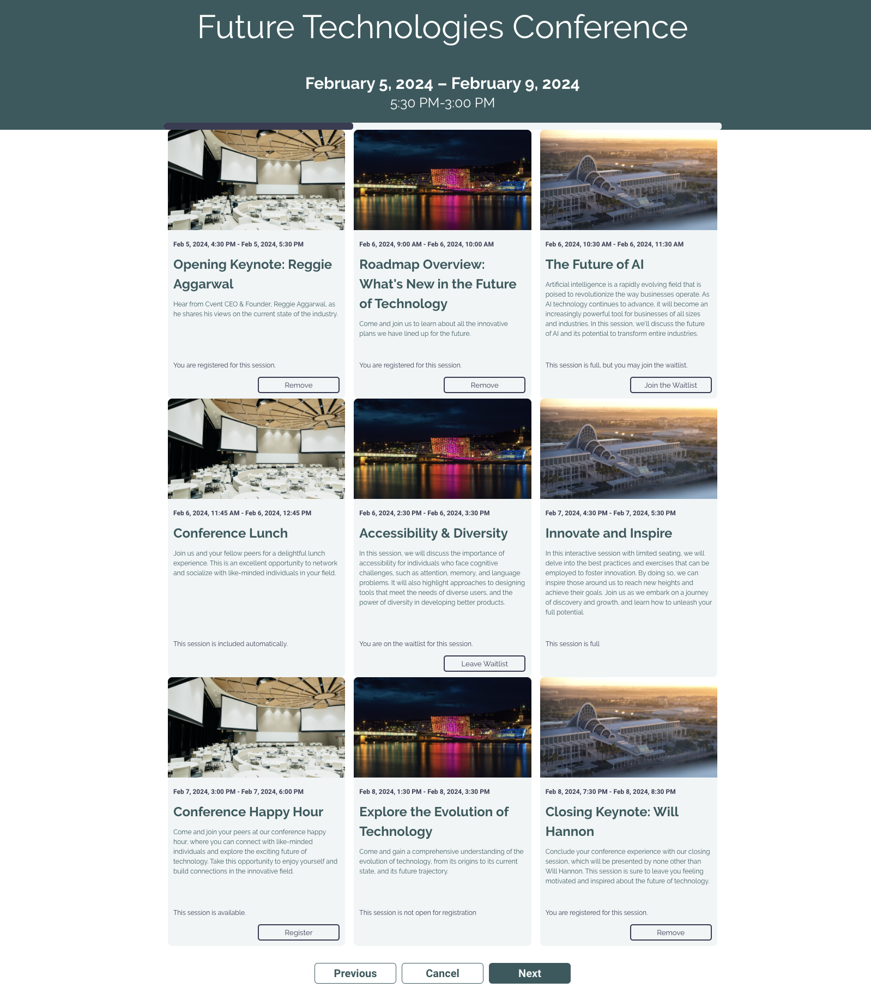

# The Featured Session Registration Widget

Browse the code [here](https://github.com/cvent/custom-widgets-labs/tree/main/examples/RegistrationWidget)

This custom widget for session registration is adapted from the FeaturedSessionWidget example. In addition to using the `getSessionGenerator` method to display basic information about the session, this widget uses the `getSessionStatus` method to determine the registration status of the session and display text explaining to the user why they can or cannot register/waitlist for the session. The `pickSession` method is also used to commit registration actions for those sessions that are in an actionable status. For more information on these methods, refer to the documentation [here](../../docs/sdk/Registration.md).

The below image shows the Featured Registration Widget used several times in the registration site. The widget displays sessions in various registration statuses and, if the session is actionable, renders a button that will commit a registration action for that session.

